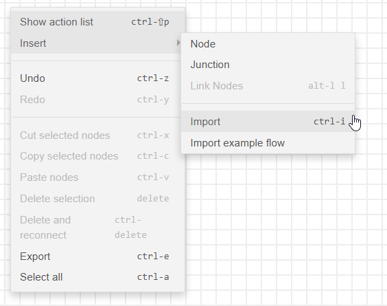
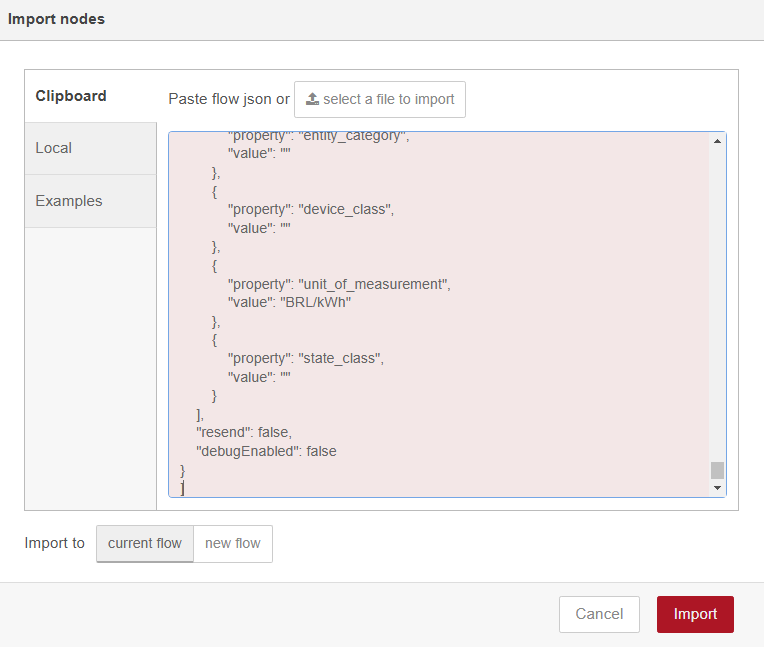
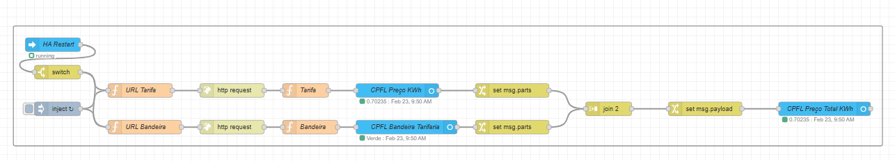
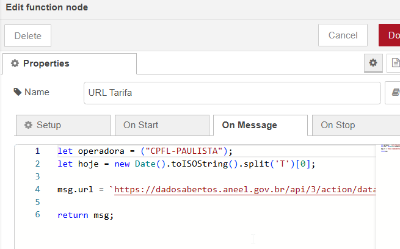

# Node-red

Para utilizar:

* copie o conteúdo do arquivo aneel-tarifas.json
* Abra o node-red, crie um flow.
* Clique com botão direito insert -> import

* Cole

* Você deve ver o workflow

Modificando valores:

Existem 2 valores a serem modificados:

* Periodicidade: No node Inject mude de quanto em quanto tempo o flow deve rodar. (default: 1h)
* Operadora: Muda no node URL Tarifa o nome da operadora

